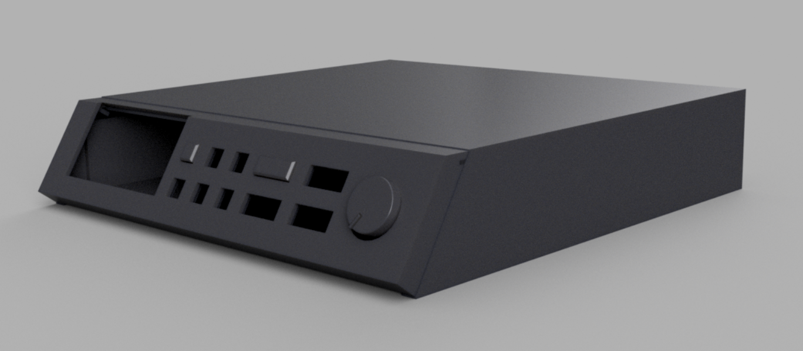
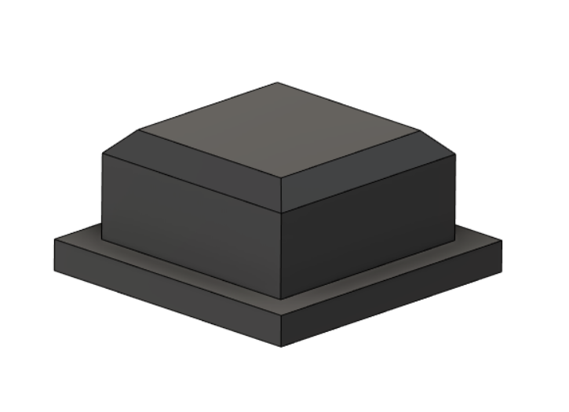
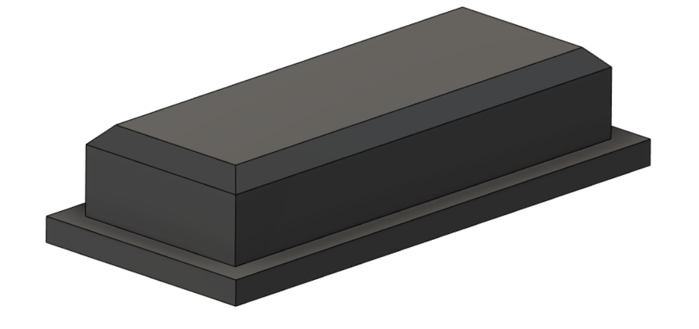

# MT-32 Mini

This project aims to provide CAD drawings and materials to a faithful reproduction of the [Roland MT-32](https://en.wikipedia.org/wiki/Roland_MT-32) MIDI synthesizer in a 3D printable scale.

The intention is to use the case with the [mt32-pi project](https://github.com/dwhinham/mt32-pi) for a complete retro gaming experience.

The project has started as a response to the lack of MT-32 synths available *in the wild* as well as the increasing price of the original vintage synth hardware.

Please report any suggestions or issues using the GitHub issue tracker. 
Interested in purchasing ready-to-use products? Contact <a href="mailto:sales@retrocity.no">sales@retrocity.no</a>.

 

 

## Licensing
 3D Models, CAD-files, images and image-renders are licensed under a <a rel="license" href="http://creativecommons.org/licenses/by-sa/4.0/">Creative Commons Attribution-ShareAlike 4.0 International License</a>.
  
 
All original programs and scripts related to this project are licensed under the <a rel="license" href="https://www.gnu.org/licenses/gpl-3.0.en.html">GNU General Public License v3</a> unless otherwise is specifically stated. 3rd party software, utilities and libraries are subject to their respective licenses.

## Components

### Front Panel

There are three front panels planned (full size replica, half-rack version, compact version). 

### Buttons

The standard buttons are modelled to fit standard mechanical PCB mounted DPDT momentary switches through hole buttons with 2mm x 3mm square top. The front panel model have screw hole support to fit all the buttons on a prototyping PCB.

Recommended pushbuttons for your project:

* [Knitter-Switch MPSA-22E08-0150](https://no.rs-online.com/web/p/push-button-switches/9138895/)
* [E-Switch TL2285OA](https://no.mouser.com/ProductDetail/E-Switch/TL2285OA/?qs=sGAEpiMZZMsqIr59i2oRcnyUDSvNf1qzMFKMnZGBfMI%3D) (test pending)

| Small Button | Large Button |
|--------------|---------------|
|   | 

### Volume Knob

The volume knob. For the **mt32-pi** project this is intended to be a rotary encoder for added functionaliy.

### Cover

The sleeve that covers the frame and the internals.

### Frame

The frame that mount the internals.
